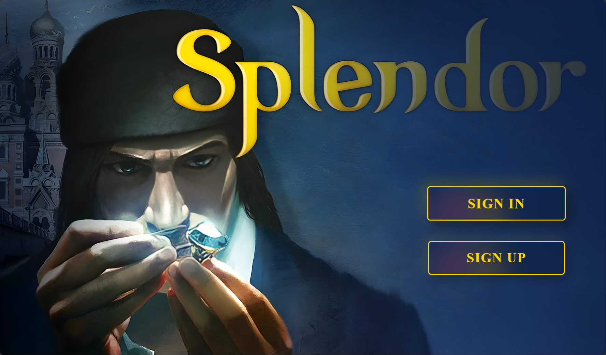
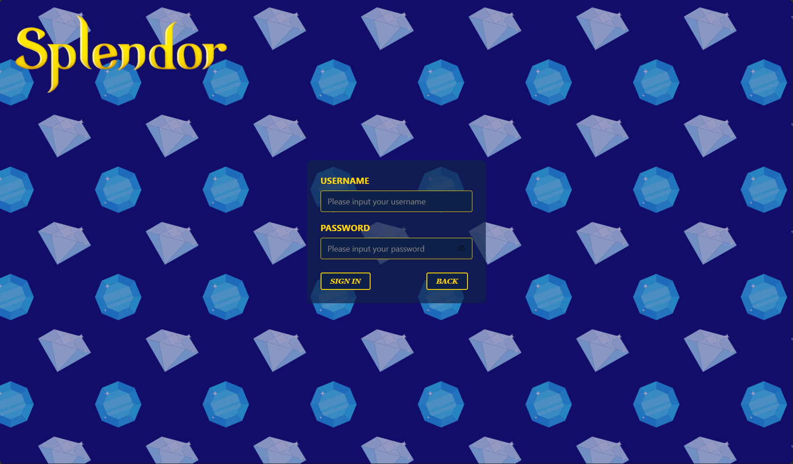
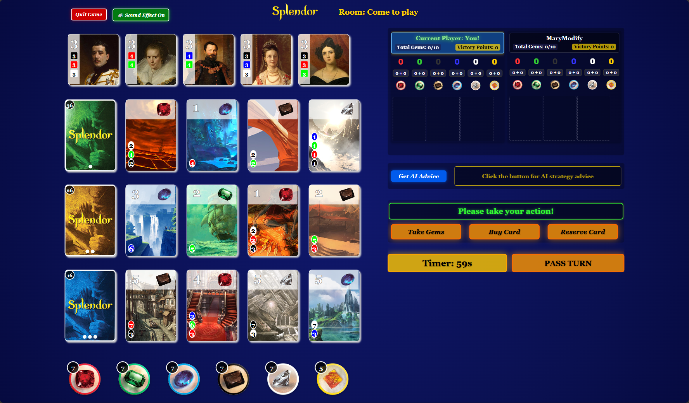

# Splendor Online Board Game
   
     


---
## Table of Contents

- [Splendor Online Board Game](#splendor-online-board-game)
  - [Table of Contents](#table-of-contents)
  - [Introduction](#introduction)
  - [Technologies](#technologies)
  - [High-Level Components](#high-level-components)
  - [Launch \& Deployment](#launch--deployment)
    - [Environment](#environment)
  - [Setup with Your IDE](#setup-with-your-ide)
    - [IntelliJ IDEA](#intellij-idea)
    - [VS Code](#vs-code)
  - [Building \& Running](#building--running)
    - [Build Frontend](#build-frontend)
    - [Run Frontend](#run-frontend)
    - [Build Backend](#build-backend)
    - [Run Backend](#run-backend)
  - [Illustrations](#illustrations)
  - [Roadmap](#roadmap)
  - [Game Wiki](#game-wiki)
    - [Contents \& Setup](#contents--setup)
    - [Game Overview](#game-overview)
    - [Win Conditions (15 Prestige)](#win-conditions-15-prestige)
    - [Actions \& Flow](#actions--flow)
    - [Resources \& Discounts](#resources--discounts)
    - [Noble Tiles](#noble-tiles)
    - [End of Game](#end-of-game)
  - [Authors \& Acknowledgement](#authors--acknowledgement)
  - [License](#license)

## Introduction

Splendor Online is a web-based multiplayer adaptation of the popular board game Splendor, designed for 2–4 players. Each player takes turns collecting gems and purchasing development cards to build their trade network and earn prestige points.

On each turn, players can:

- Take gem tokens (emerald, diamond, sapphire, onyx, ruby)
- Buy development cards, which offer permanent gem bonuses and prestige(Victory points)
- Reserve cards for later use and gain a wildcard (gold token)

As you accumulate bonuses, Noble tiles may automatically join you if your gem bonuses meet their requirements—granting additional prestige points. The first player to reach 15 prestige(Victory points) triggers the endgame, and the player with the most points wins.

Key features:

- Real-time online matches with 2–4 players
- Turn timer to keep the game moving
- Optional AI Advisor for in-game strategic suggestions
- No download, no setup—just open the browser and start playing

Whether you're familiar with the tabletop version or trying it for the first time, Splendor Online provides a smooth and accessible way to enjoy the game with friends.

## Technologies

- **WebSockets (Custom JSON Protocol)**  
  We leverage Spring Boot’s native WebSocket support to power all real-time interactions—game state updates (`GAME_STATE`), chat (`CHAT_MESSAGE`), turn timers, and AI hint requests (`AI_HINT`). A single endpoint registers a `WebSocketHandler` on server startup, routing messages by `sessionId` and `roomId`. On the client, our `useWebSocket` hook handles connection lifecycle, automatic reconnection, JSON parsing, and dispatch into React Context.
- **Google Gemini API (AI Strategy Hints)**  
  To provide in-game strategic advice, the client emits an `AI_HINT` over WebSocket. The Spring service then calls Google’s Gemini generative-language endpoint (`gemini-2.5-flash-preview-04-17:generateContent`) using `gemini.api.key` and `gemini.api.url`. We package a concise system prompt plus the current turn snapshot, then stream back the AI’s one-sentence recommendation (e.g. “Take 2 Blue Gems”) as a `AI_HINT` message. Usage is limited to three hints per player per game to balance assistance and performance.


## High-Level Components

* **Authentication**

  * `/login` & `/sign_up` for user management
  * `/users` to view & edit profile (name, avatar, password)
* **Lobby**

  * `/lobby` to list, create, or join game rooms
* **Room**

  * `/room/[id]` shows current players, “Start Game” button, and chat
* **Game**

  * `/game/[id]` board view with:

    * Take gems (2 same or 3 different)
    * Buy or reserve cards
    * AI advice button
    * Real-time chat & turn timer
* **Tutorial**

  * `/tutorial` interactive, step-by-step guide through core rules
* **Rules**

  * `/tutorial/rules` full text rules and victory conditions

* **LeaderBoard**

  * `/leaderboard` trace all Players' performance

## Launch & Deployment

Both frontend and backend are public GitHub repos:

* Client → [https://github.com/Sopra-FS25-group-28/sopra-fs25-group-28-client](https://github.com/Sopra-FS25-group-28/sopra-fs25-group-28-client)
* Server → [https://github.com/Sopra-FS25-group-28/sopra-fs25-group-28-server](https://github.com/Sopra-FS25-group-28/sopra-fs25-group-28-server)

### Environment

* Node.js ≥16 / npm
* Java 17
* (Optional) Google Cloud SDK

## Setup with Your IDE

### IntelliJ IDEA

1. Clone the **server** repo and open in IntelliJ.
2. Import as a **Gradle** project.
3. Ensure **Java 17** SDK is selected.
4. Run `Application.java` or use the Gradle **bootRun** task.

### VS Code

1. Clone both **client** and **server** folders.
2. Install recommended extensions: ESLint, Prettier, vscjava.vscode-java-pack, vmware.vscode-spring-boot
3. Use integrated terminal to execute the commands below.

## Building & Running

### Build Frontend

```bash
cd sopra-fs25-group-28-client
npm install
npm run build
```

### Run Frontend

```bash
npm run dev       # Opens at http://localhost:3000
npm run start     # Production mode
```

### Build Backend

```bash
cd sopra-fs25-group-28-server
./gradlew bootJar
```

### Run Backend

```bash
java -jar build/libs/sopra-fs25-group-28-server-0.0.1-SNAPSHOT.jar
# Server on http://localhost:8080
```

**H2 Console:** [http://localhost:8080/h2-console](http://localhost:8080/h2-console)
JDBC URL: `jdbc:h2:mem:testdb` | User: `sa` | (no password)

## Illustrations

 The user starts by either signing or loging in. As soon as the user is on the home site he has the choice between creating or joining a game, look tutorial, check leaderboard, edit profile, or logout.


* **Home / Sign up / Login**

  

  

  
  

* **Game Lobby / Game Room**

  

  

* **Game Board**

  

* **Tutorial**
  

* **Rules**
  


## Roadmap

### Completed Milestones
- Core Gameplay Mechanics  
  - Full implementation of turn-based logic: take gems, reserve/buy cards, gain nobles.  
  - Victory detection and game-over screen with real-time UI update.

- Real-Time Communication  
  - WebSocket-based messaging system for room status, game events, and in-game chat.  
  - Synchronization of player actions and board state across multiple clients.

- AI Strategy Hint  
  - Integrated Gemini API for generating strategy suggestions.  

- Modular UI Component System  
  - Card grid, player panel, noble display, timer, and chat separated into reusable components.  
  - `ResponsiveGameWrapper` developed to scale the entire UI responsively via viewport-based transform.

- Token-based Lobby System  
  - Room creation, player join/leave logic, and game start restricted to authenticated users.
 
### Future Goals
- AI Bots  
  - Support AI players via strategy modules (e.g., greedy bot, minimax bot).
- Mobile Responsiveness Enhancements  
  - Further optimize layout and scaling for touch-based interaction and smaller screens.
- Multi-language Support  
  - Add support for multiple languages.
  
  

## Game Wiki

### Contents & Setup

- **40 gem tokens** (7 each of Emerald, Sapphire, Ruby, Diamond, Onyx; 5 Gold jokers)  
- **90 Development cards** (40 Level 1, 30 Level 2, 20 Level 3)  
- **10 Noble tiles**

**Setup (4-player)**  
1. Shuffle each deck, stack by level.  
2. Reveal 4 cards from each level in a row.  
3. Shuffle Nobles, reveal 5. Return the rest.  
4. Sort tokens by color into six piles.  
5. Youngest player takes the First Player marker.

_Adjust for 2–3 players by removing extra tokens and fewer Nobles._

---

### Game Overview

On your turn you must perform **exactly one** of:

- **Take 3 different gems** (no gold; only if ≥3 colors available)  
- **Take 2 gems of the same color** (only if ≥4 in supply; no gold)  
- **Reserve 1 Development card & take 1 gold** (max 3 reserved)  
- **Purchase 1 Development card** (face-up or reserved)

Your **Development cards** grant Prestige(Victory Points) and **permanent discounts** (the card’s color) for future purchases. Collect enough discounts to buy cards for free!

At the end of your turn, check **Noble tiles**: if you meet a tile’s color-card requirements, you automatically gain that Noble (worth 3 Prestige). Only one Noble per turn.

As soon as any player reaches **15 Prestige(Victory Points)**, the game goes in **FINAL TURN**, so everyone has equal turns. The player with the most Prestige wins. 

---

### Win Conditions (15 Prestige)

| Condition                  | How to Achieve                                                                 |
|----------------------------|--------------------------------------------------------------------------------|
| **Development Cards**      | Purchase Development cards worth a total of 15 Prestige(Victory Points) ,counting Nobles.      |
| **Nobles**                 | Attract enough Nobles to push your Prestige(Victory Points) to 15.                             |

---

### Actions & Flow

1. **Choose an action** (Take gems, Reserve, Purchase).  
2. **Resolve** the action immediately (draw, pay cost, claim Noble).  
3. **End turn** (pass to next player or automatic if timer expires).

---

### Resources & Discounts

- **Gems** (emerald, sapphire, ruby, diamond, onyx) and **Gold** (wild).  
- **Bonuses** from your face-up cards reduce future gem costs by one per bonus.

---

### Noble Tiles

- Each Noble requires a specific set of colored bonuses.  
- Visit automatically at turn’s end if requirements met.  
- Worth 3 Prestige(Victory Points) each; only one per turn.

---

### End of Game

- Trigger: a player reaches **15 Prestige(Victory Points)** at turn’s end.  
- Final round: every player takes one last turn in seating order.  
- Victory: highest Prestige(Victory Points); tie → fewest Development cards wins.

## Authors & Acknowledgement

**Group 28**

* Yiming Xiao ([`yimxia`](https://github.com/yimxia))
* Zizhou Luo (Leader, [`Skiingseason`](https://github.com/Skiingseason))
* Haizhou Zheng ([`Haizhouzhou`](https://github.com/Haizhouzhou))
* Philip Spasojevic ([`SopraPH`](https://github.com/SopraPH))

Special thanks to TA **Ambros Eberhard** for semester-long support.

## License

This project is licensed under **Apache 2.0**. See [LICENSE](./LICENSE) for details.

## Third-party Assets and Licenses

This project includes sound effects from [Pixabay](https://pixabay.com/sound-effects/), used under the [Pixabay Content License](https://pixabay.com/service/license-summary/).

- Free for commercial and non-commercial use
- No attribution required (although credit is appreciated)
- Allowed to be modified and integrated into other works
  
Thanks to the Pixabay community for providing high-quality, royalty-free audio content.

This project also includes cursor assets from the Cursor Pack (1.1) created by [Kenney](https://www.kenney.nl), used under the [Creative Commons Zero (CC0) License](http://creativecommons.org/publicdomain/zero/1.0/).

- Free to use in personal, educational, and commercial projects
- No attribution required
- Allowed to be modified and redistributed

Thanks to Kenney for providing high-quality, freely available game assets. 
